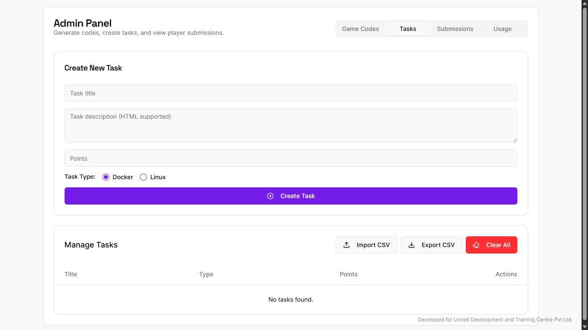
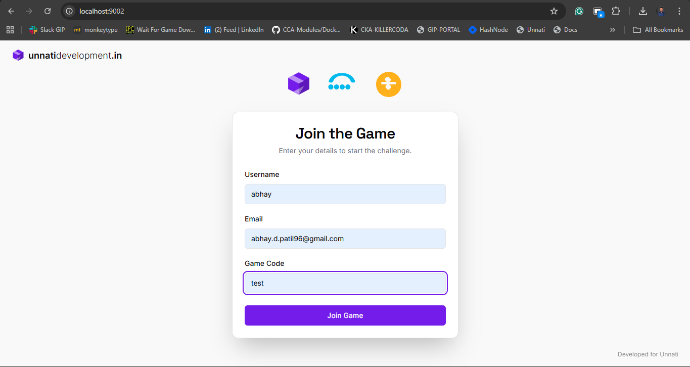
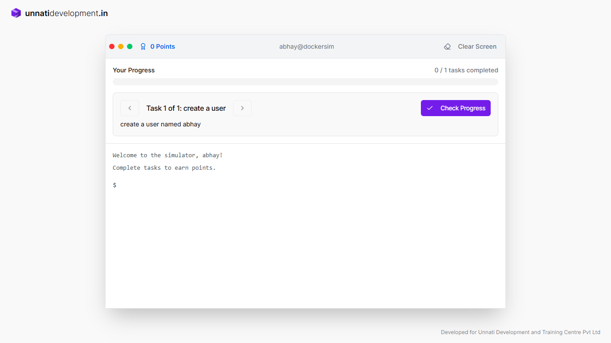
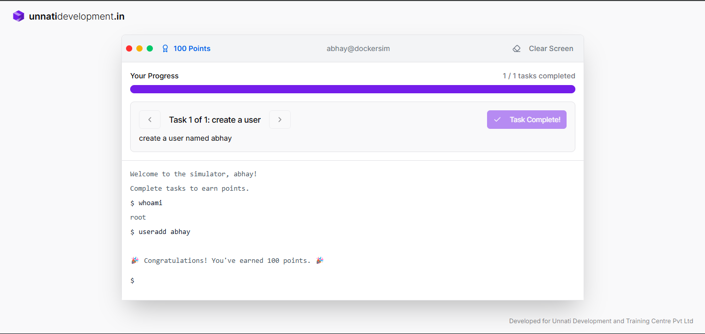

# 🐧 Interactive Linux & Docker Task Game  

**Developed by:** *Ashutosh S. Bhakare : CEO - Unnati Development & Training Center*  
**Platform:** Firebase Studio  
**Category:** Educational / Gamified Learning  

---

## 🎯 Overview  

The **Interactive Linux & Docker Task Game** is a web-based learning platform designed for students who want to sharpen their **Linux** and **Docker** skills through fun, hands-on challenges.  

Built on **Firebase Studio**, this application transforms the learning experience into an interactive journey where users complete real-world system administration and containerization tasks — all inside a gamified interface.  

The application runs inside a **Docker container**, making it portable, fast, and super easy to deploy anywhere.  

---

## 🚀 Quick Start  

### **Step 1: Pull the Docker Image**

The public image is available on **Docker Hub**.  
You can pull it directly using:

```bash
docker pull ashutoshbhakare/dcom5
```

---

### **Step 2: Run the Application**

Launch the container with the following command:

```bash
docker run -d -p 9002:9002 -e GEMINI_API_KEY="********************"  ashutoshbhakare/dcom5
```

🧠 **Explanation of Environment Variables:**
#for the next version*
| Variable | Description |
|-----------|--------------|
| `NEXT_PUBLIC_BRAND_URL` | Your application’s base URL |
| `ADMIN_USERNAME` | Username for the admin dashboard |
| `ADMIN_PASSWORD` | Password for admin access |
| `GEMINI_API_KEY` | API key used for AI-powered interactions within the app |

---

### **Step 3: Access the Application**

Once the container is running, open your browser and visit:

👉 [http://localhost:9002](http://localhost:9002)

You’ll now have access to the **Interactive Linux & Docker Game Interface**!

---

## 🧩 Features  

- 🐧 **Linux Challenges:** Solve beginner-to-advanced level Linux tasks interactively.  
- 🐳 **Docker Task Arena:** Learn Docker commands by completing real-time container-based puzzles.  
- 🎮 **Gamified Interface:** Earn points and track progress as you master each challenge.  
- 🔐 **Admin Dashboard:** Manage users, monitor tasks, and track performance.  
- ☁️ **Firebase Integrated:** Secure authentication and real-time updates powered by Firebase.  

---

## 🛠️ Requirements  

- **Docker** (v20+ recommended)  
- **Internet Connection** (for pulling image and For the API Call)  
- **Valid GEMINI API Key** (for AI-based task hints and chat)  

---

## 🧑‍💻 Developed & Maintained By  

**Unnati Development & Training Center**  
Empowering students to learn DevOps, Cloud, and Open Source technologies through hands-on education.  

---

## 📢 Connect & Contribute  

If you’re a student or trainer and would like to contribute new Linux or Docker challenges, feel free to fork the repository or contact the Unnati Dev Team.  

**Feedback and feature requests are always welcome!**  

---

### 🐋 Example Command Recap

```bash
docker run -d -p 9002:9002 -e GEMINI_API_KEY="********************"  ashutoshbhakare/dcom5
```

Access it at: **http://localhost:9002**
Access admin panal at: **http://localhost:9002/admin**


---
# 🧭 Admin Panel — Docker Commander

**Developed by:** Unnati Development & Training Center  
**Built on:** Firebase Studio  
**Purpose:** Interactive Linux & Docker Task Game for Students  

---

## 📖 Overview

The **Admin Panel** of **Docker Commander** empowers instructors and administrators to create, manage, and monitor **interactive Linux and Docker challenges** for students.


It is a secure, containerized web application that enables trainers to:
- Generate unique **game codes** for each session,
- Create and assign **hands-on Linux/Docker tasks**,
- Monitor **student progress** and **submissions**, and
- Track overall usage and performance analytics.

Admins must **log in using a username and password** before gaining access to the Admin Dashboard.

---

## 🚀 Getting Started

### 1️⃣ Pull the Docker Image

The official image is available publicly on Docker Hub.  
To get started, pull the image using:

```bash
docker pull ashutoshbhakare/dcom5
```

# 2️⃣ Run the Application

Run the Docker container on port 9002, setting the required environment variables for your setup:

```bash
docker run -p 9002:9002 \
  -e GEMINI_API_KEY="your_gemini_api_key" \
  ashutoshbhakare/dcom5
```
---
## 🧠 Student Landing Page – Join the Game  

When students visit the application on **port 9002**, they’ll be greeted with a clean and interactive **“Join the Game”** screen — the starting point of their learning journey.  


image will be here
### ✨ Page Overview

The **Join the Game** page allows students to enter basic details and access their assigned challenges.  
It provides a simple and elegant way to begin interactive Linux or Docker tasks.

### 🧩 Fields Description

| Field | Description |
|--------|-------------|
| **Username** | The display name of the student joining the session. |
| **Email** | Used for tracking progress and sending notifications. |
| **Game Code** | A unique code provided by the instructor to join a specific task session or challenge. |

After filling out these details, the student clicks the **“Join Game”** button to start their challenge session.

---

### 💡 Key Highlights

- 🎮 **Interactive Start:** Students instantly jump into gamified Linux/Docker tasks.  
- 🔐 **Session-Based Access:** Each challenge is controlled via a unique game code.  
- 🎨 **Modern UI:** Clean, responsive, and powered by Firebase Studio frontend.  
- 🧭 **Easy to Use:** Just enter your name, email, and game code — and you’re ready to learn!  
- 🧱 **Built for Unnati Development & Training Center:** Designed specifically for hands-on DevOps education.

---

Once a user joins, they are redirected to their respective **task dashboard**, where the learning game begins!

## 🧱 Docker Task Simulator – Student Progress View  

After joining the game, students enter the **Docker Task Simulator** interface — an interactive environment where they execute Linux and Docker tasks in real-time.



### 🧩 Page Overview  

The **Docker Commander** dashboard provides students with task descriptions, progress tracking, and a built-in terminal simulator where commands are executed.  
It’s designed to make Linux and Docker learning **fun, interactive, and measurable**.

---

### 🧠 Interface Breakdown  

| Section | Description |
|----------|-------------|
| **Progress Bar** | Displays the number of tasks completed vs. total tasks. |
| **Task Window** | Shows the current task — e.g., `Task 1 of 1: Add user`. |
| **Command Simulator** | Terminal-style interface where students type commands. |
| **Check Progress Button** | Validates the executed command and updates progress points. |
| **Clear Screen Button** | Clears the terminal output for a cleaner workspace, just like a real CLI. |
| **Points Indicator** | Tracks the total score earned through task completion. |

---

### ⚙️ Example  

For the given example:  
**Task:** *Add a user named `abhay`*  
The student would type:  
```bash
adduser abhay
```

